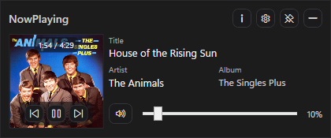
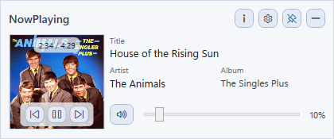
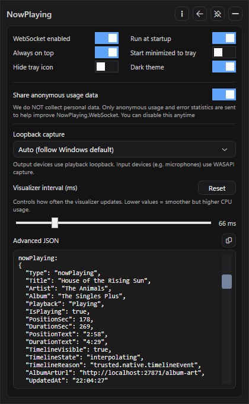
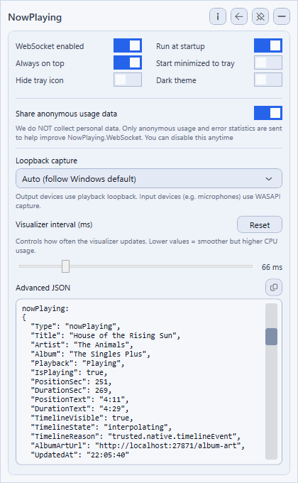
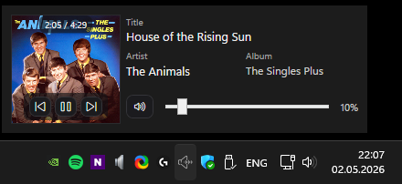
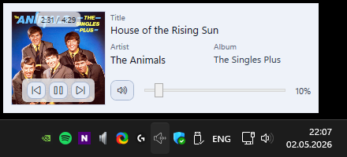
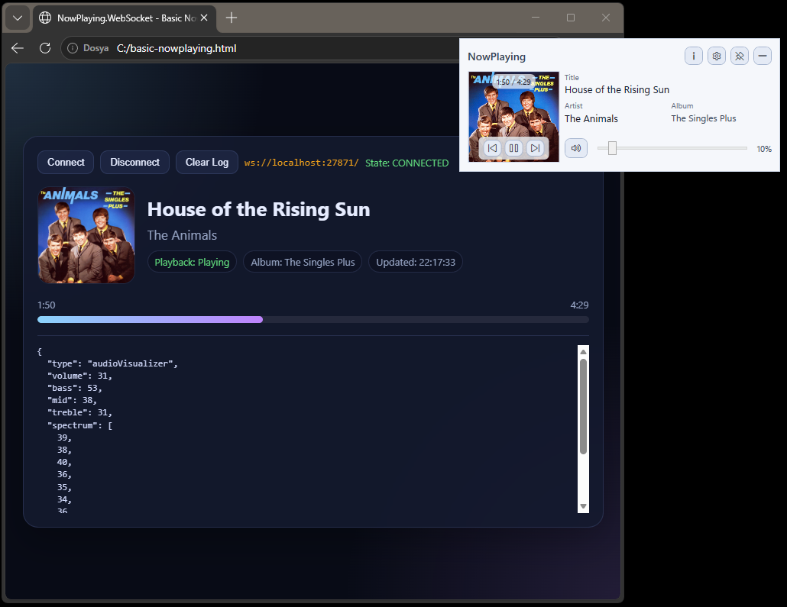
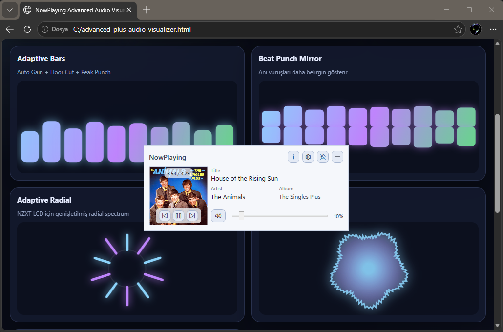

# 🎧 NowPlaying.WebSocket

Real-time **Windows Now Playing data** + **Audio Visualizer JSON over WebSocket**

NowPlaying.WebSocket is a lightweight Windows application that:

- Streams Now Playing media data  
- Streams real-time Audio Visualizer data  
- Exposes everything via local WebSocket (JSON)  
- Works as a standalone desktop media controller  

App Main ScreenShots
<p align="left">
  
  
</p>

Settings UI
<p align="left">
  
  
</p>

Flyout UI
<p align="left">
  
  
</p>

## 🔥 Why this project exists

Most tools can show *Now Playing*.

Very few provide:

- Real-time Audio Visualizer data  
- Clean JSON over WebSocket  
- Easy integration for browser apps, overlays, or OBS  

This app focuses on all of them together.

---

## ⚡ Core Features

### 🎵 Real-Time Audio Visualizer (WebSocket)

The main feature.

The app streams live audio analysis data:

- Volume level  
- Bass / Mid / Treble  
- Frequency spectrum array  

Perfect for:

- Audio visualizers  
- Reactive UI  
- OBS browser sources  
- Web-based overlays  
- Stream tools  

📡 Endpoint: `ws://localhost:27871`

---

### 🎧 Now Playing Data (Live JSON)

Real-time media information:

- Title  
- Artist  
- Album  
- Playback state  
- Timeline (position / duration)  
- Album art URL  

---

### 🔊 Example: Audio Visualizer

```json
{
  "Type": "audioVisualizer",
  "Volume": 35,
  "Bass": 59,
  "Mid": 43,
  "Treble": 40,
  "Spectrum": [50,36,42,40,41,38,37,42,38,41],
  "UpdatedAt": "21:18:20"
}
```

🎵 Example: Now Playing

```
{
  "Type": "nowPlaying",
  "Title": "Come Together - Remastered 2009",
  "Artist": "The Beatles",
  "Album": "Abbey Road (Remastered)",
  "Playback": "Playing",
  "IsPlaying": true,
  "PositionSec": 74,
  "DurationSec": 259,
  "PositionText": "1:14",
  "DurationText": "4:19",
  "AlbumArtUrl": "http://localhost:27871/album-art"
}
```

#### 🖥️ Desktop App Features

Not just a WebSocket server a full Windows app.

##### 🎮 Media Controls
- Play / Pause
- Next / Previous
- Mute / Unmute
- Volume control (slider + mouse wheel)

##### 🧩 Smart UI & Tray
- Tray icon with quick access
- Click to open flyout panel
- Lightweight, always accessible

##### ✨ Quality of Life
- Click Title / Artist / Album → copy to clipboard
- Always on top (optional)
- Run at startup
- Start minimized to tray
- Dark theme
- Hide tray icon

##### 🔊 Audio Capture & Devices
+ Automatic loopback capture
+ Manual device selection:
  + Speakers
  + Headphones
  + Microphones (WASAPI)

##### 🎚️ Visualizer Interval

Control update speed:
- Lower = smoother animation
- Higher = lower CPU usage

Useful for fine-tuning real-time visualizers.

##### 🖼️ Album Art: `http://localhost:27871/album-art`

Use directly in:
- ``
- Canvas apps
- Overlays

#### 🌐 Built for Developers

Designed for:
- Frontend developers
- OBS users
- Stream tool creators
- Dashboard builders

## 🌐 Examples (Ready-to-Use HTML)

This repository includes ready-to-use HTML examples that connect to the WebSocket server and visualize real-time data.

👉 Just open them in your browser while the app is running.

### 🎵 Basic Now Playing

<p align="left">
  
</p>

- Displays title, artist, album  
- Shows playback state  
- Timeline & progress bar  
- Live JSON stream  

📄 File: [examples/basic-nowplaying.html](https://github.com/mrgogo7/NowPlaying.WebSocket/tree/main/examples "examples/basic-nowplaying.html")

### ⚡ Advanced Audio Visualizer

<p align="left">
  
</p>

- Adaptive bars  
- Beat punch effect  
- Radial visualizer  
- Smoothing & gain control  

📄 File: [examples/advanced-plus-audio-visualizer.html](https://github.com/mrgogo7/NowPlaying.WebSocket/tree/main/examples "examples/advanced-plus-audio-visualizer.html")

##### 💡 Use Cases
- Audio Visualizer (web)
- OBS browser source
- Desktop widgets
- Music dashboards
- Stream overlays
- Web-based music UI

#### 📦 Download

Latest version: `https://github.com/mrgogo7/NowPlaying.WebSocket/releases/download/v6.4.30/NowPlaying.WebSocket_v6.4.30.0.exe)`

#### 🔐 Privacy
- No personal data collected
- No media content sent externally
- Everything runs locally
Optional: Anonymous usage analytics (can be disabled)

### ☕ Support

If you find this useful: [](https://buymeacoffee.com/mrgogo)

##### ⚠️ Notes
This repository contains compiled application only
Source code is not included

### 📄 License

Free for personal use.
Commercial use requires permission.
